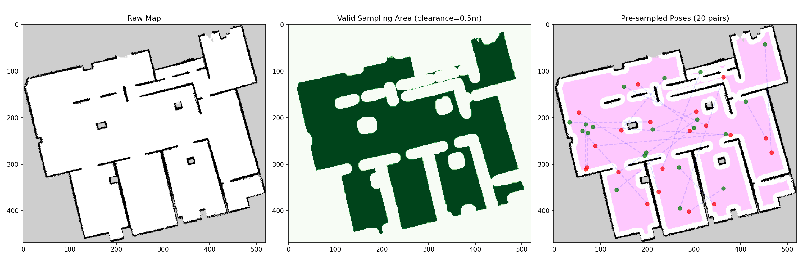

# Nav2 Pose Sampler

Sample random start and goal poses from ROS occupancy grid maps for navigation experiments. No ROS installation required.



## What It Does

Given a standard ROS map (YAML + PGM/PNG), this tool:

1. Loads the occupancy grid and computes a distance-from-obstacles field
2. Identifies valid free-space cells with configurable obstacle clearance
3. Samples random (start, goal) pose pairs with distance constraints
4. Saves poses to JSON for reproducible experiments
5. Generates visualizations showing the map, valid area, and sampled poses

Designed for automated navigation benchmarking and RCT (Randomized Controlled Trial) data collection with Nav2.

## Installation

```bash
pip install numpy Pillow scipy PyYAML matplotlib
```

Then clone and install:

```bash
git clone https://github.com/kas-lab/random-pose-generator.git
pip install -e .
```

## Quick Start

### Command Line

```bash
# Visualize valid sampling area with 30 random pose pairs
python3 main.py --map /path/to/map.yaml --visualize --n-samples 30

# Generate 3000 poses and save to JSON
python3 main.py --map /path/to/map.yaml --generate 3000

# Both at once — generate + visualize
python3 main.py --map /path/to/map.yaml --generate 500 --visualize

# Custom distance constraints and obstacle clearance
python3 main.py --map /path/to/map.yaml --generate 1000 \
    --min-distance 2.0 --max-distance 8.0 --clearance 0.3

# Visualize an existing poses file
python3 main.py --map /path/to/map.yaml --visualize \
    --poses ./pose_data/poses.json

# Reproducible generation with a seed
python3 main.py --map /path/to/map.yaml --generate 500 --seed 42
```

## Output Format

### JSON (`poses.json`)

```json
[
  {
    "id": 0,
    "start": {"x": 3.45, "y": -1.20, "yaw": 1.57},
    "goal": {"x": 7.10, "y": 2.85, "yaw": -0.78},
    "distance": 5.42
  },
  ...
]
```

### Visualization (`sampling_area.png`)

The visualization shows three panels side by side:

| Panel | Description |
|-------|-------------|
| **Raw Map** | The original occupancy grid (white = free, black = occupied, gray = unknown) |
| **Valid Sampling Area** | Green cells where poses can be sampled (free space with sufficient obstacle clearance) |
| **Sampled Poses** | Map overlay with green dots (start), red dots (goal), and blue dashed lines connecting each pair |

## Parameters

| Parameter | Default | Description |
|-----------|---------|-------------|
| `--map` | (required) | Path to ROS map YAML file |
| `--clearance` | 0.5 | Minimum distance from obstacles (meters) |
| `--min-distance` | 3.0 | Minimum start-to-goal distance (meters) |
| `--max-distance` | 15.0 | Maximum start-to-goal distance (meters) |
| `--seed` | None | Random seed for reproducibility |
| `--output` | `./pose_data` | Output directory |

## Map Format

The tool reads standard ROS `map_server` format:

**`map.yaml`:**
```yaml
image: map.pgm
resolution: 0.05
origin: [-14.2, -12.2, 0.0]
occupied_thresh: 0.65
free_thresh: 0.25
negate: 0
```

The image file (`.pgm` or `.png`) should be a grayscale occupancy grid where white (254) is free space and black (0) is occupied.


